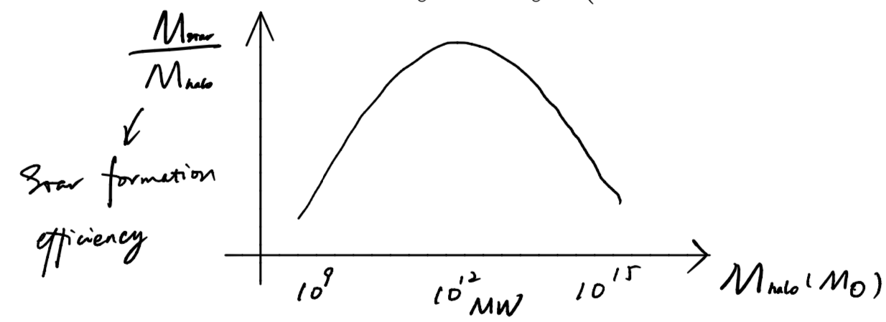
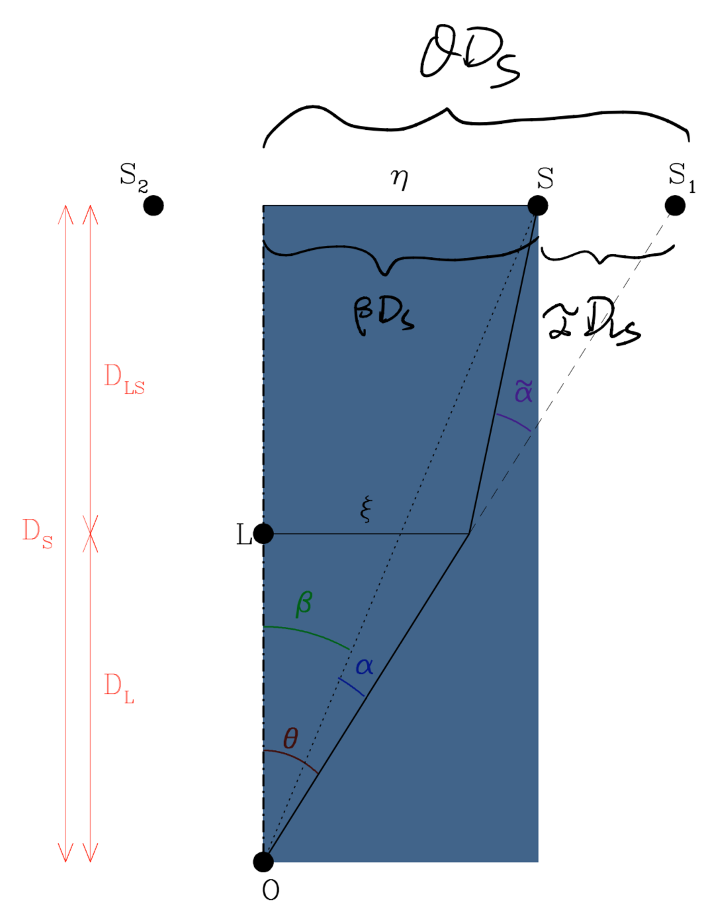

# Chapter 9 Dark Matter

## Introduction

- A **mismatch** between
  - The amount of matter known (or at least suspected) to be present
  - The amount of matter we see ina given environment or volume
- Baryonic dark matter
  - Stars & remnants (mostly WDs) account for < 10% of the baryons (deduced from the relative abundances of light elements created in BBN + fluctuations in CMB)
  - In the form of intergalactic gas (Ly $\alpha$ forests)
  - High temperature - WHIM (Warm-Hot Intergalactic Medium), FUV+X ray radiation
- Non-Baryonic dark matter

## Mass-to-Light Ratio

- In **B-band** ($\sim3800\ \overset\circ{\text{A}}-4800\ \overset\circ{\text{A}}$), measured in solar units $\mathrm{M}_{\odot} / \mathrm{L}_{\odot, \mathrm{B}}$

###The Milky Way

$$
L_{\mathrm{MW}, \mathrm{B}} \simeq2.3 \times 10^{10}\ \mathrm{L}_{\odot, \mathrm{B}}
$$

- Dependence of stellar luminosity on mass (quite steep) $L \propto M^{\sim 3.5}$

- Most of the luminosity of a stellar population is contributed by the most massive stars $M / L_{\mathrm{B}} \sim 10^{-3}\ \mathrm{M}_{\odot} / \mathrm{L}_{\odot, \mathrm{B}}$

- Most of the mass is in the far more numerous and fainter low-mass stars $M / L_{\mathrm{B}} \sim 10^{3}\ \mathrm{M}_{\odot} / \mathrm{L}_{\odot, \mathrm{B}}$

- Within 1 kpc from the Sun
  $$
  \left\langle M / L_{\mathrm{B}}\right\rangle \approx 4\ \mathrm{M}_{\odot} / \mathrm{L}_{\odot, \mathrm{B}}
  $$

### Larger scale

- Integrating the luminosity function (LF, the number of galaxies per unit volume with luminosity in the range $[L, L+d L]$) of galaxies within hundreds of Mpc from our location

  - Assumption 1 - the slope in the LF applies for unobserved lower massive galaxies

  - Total stellar luminosity
    $$
    j_{\text {stars,} \mathrm{B}}=1.1 \times 10^{8} \mathrm{L}_{\odot, \mathrm{B}}\ \mathrm{Mpc}^{-3}
    $$

  - If there are too many low mass galaxies, the integration might diverge

  - Assumption 2 -  the mass-to-light ratio in the neighborhood of the solar system also applies to most of the galaxies

  Under these assumptions, the mass density is
  $$
    \rho_{\text {stars,} \mathrm{B}}=1.1 \times 10^{8} \mathrm{L}_{\odot, \mathrm{B}} \cdot 4 \mathrm{M}_{\odot} / \mathrm{L}_{\odot, \mathrm{B}} \approx 4.4 \times 10^{8} \mathrm{M}_{\odot} \mathrm{Mpc}^{-3}
  $$

  $$
  \Omega_{\text{stars}}\approx3\times10^{-3}
  $$

## Galaxy Rotation Curves

- Spiral galaxy - thin disk rotating about the center

- Galaxy rotation curve
  $$
  v(R)=\frac{v_{\mathrm{r}}(R)-v_{\mathrm{gal}}}{\sin i}=\frac{v_{\mathrm{r}}(R)-v_{\mathrm{gal}}}{\sqrt{1-b^{2} / a^{2}}}
  $$

  - $v_{\mathrm{r}}(R)$ - velocity deduced from the Doppler shift of spectral lines from **stars/gas in the disk**
  - $v_{\mathrm{gal}}$ - systemic velocity of the galaxy indicated by the Doppler shift of **the nucleus**
  - $i$ - inclination deduced from semi-major axis $a$ and semi-minor axis $b$
    - $i=0$ - face on
    - $i=\pi/2$ - edge on

- Newtonian gravity
  $$
  v(R)=\sqrt{\frac{G M(R)}{R}}
  $$

  - Inside the bulge, $M(R)\propto R^3$, $v\propto R$
  - Outside the bulge, $M(R)=M$, $v\propto R^{-1/2}$
  - For a distribution of matter in hydrostatic equilibrium, $\rho\sim R^{-2}$, $v=Constant$

- Evidence of non-baryonic dark matter

  - For most of the spiral galaxies, the rotational velocity first increases with galactic distance $R$ and then **flattens**

  - The integrated stellar light of the disks of spiral galaxies generally falls exponentially with $R$
    $$
    I(R)=I(0) \exp \left(-\frac{R}{R_{\mathrm{s}}}\right)
    $$
    where $I$ is the surface brightness and $R_\text{s}$ is a characteristic scale-length

    - Beyond $R>3R_\text{s}$, only 3% of the light remains - mass of stars inside $R$ becomes essentially constant
    - The gravitational mass continues to increase

  - Dynamical mass of the Milky Way $M_{\mathrm{dyn}}^{\mathrm{MW}} \simeq 1 \times 10^{12}\ \mathrm{M}_{\odot}$

    - Based on the motions od satellites orbiting our galaxy

    - High values of $M / L_{\mathrm{B}}$ implied
      $$
      \left\langle M / L_{\mathrm{B}}\right\rangle \simeq 50 \mathrm{M}_{\odot} / \mathrm{L}_{\odot, \mathrm{B}}\left(\frac{R_{\mathrm{halo}}}{100\ \mathrm{kpc}}\right)
      $$
      which reflect the fact that the Milky Way disk lies at the centre of a spherical halo of non-baryonic dark matter

  - The inner regions (bulges) of spirals and ellipticals are dominated by baryons

  - Dwarf galaxies are dominated by dark matter - has led to searches for gamma-rays produced by the annihilation of particle-antiparticle pairs of some non-baryonic dark matter candidates

  - No evidence for dark matter in globular clusters

## Dark Matter in Galaxy Clusters

- Greatest concentration of matter in the Universe
- Doppler shifts
  - Systemic redshift
  - Velocity dispersion

### Virial Mass

- Relaxed cluster - no longer expanding nor contracting

  - Velocity dispersion - depth of the gravitational potential well within which dark matter, galaxies and intracluster gas move

- Virial theorem
  $$
  -2\langle K\rangle=\langle U\rangle
  $$
  where the brackets denote time averages

  - Kinetic energy
    $$
    K=\frac{1}{2} M\langle v^{2}\rangle
    $$
    where
    $$
    \langle v^{2}\rangle \equiv \frac{1}{M} \sum_{i} m_{i}\left|\dot{\mathbf{x}}_{i}\right|^{2}
    $$
    is a 3-D velocity!

  - Potential energy
    $$
    U=-\frac{1}{2} G \sum_{i, j \atop j \neq i} \frac{m_{i} m_{j}}{\left|\mathbf{x}_{j}-\mathbf{x}_{i}\right|}=-\alpha \frac{G M^{2}}{r_{\mathrm{h}}}
    $$

    - $\alpha\sim0.4$ - obtained through simulations
    - $r_\text{h}$ - half-mass radius, the radius of a sphere centered on the center of mass of the cluster and within which half of the cluster mass is contained

  - The dynamical mass of a cluster
    $$
    M=\frac{\langle v\rangle^{2} r_{\mathrm{h}}}{\alpha G}\sim 1.7 \times 10^{15} \mathrm{M}_{\odot}\left(\frac{\sigma_{\mathrm{r}}}{1000 \mathrm{km} \mathrm{s}^{-1}}\right)^{2}\left(\frac{r_{\mathrm{h}}}{1 \mathrm{Mpc}}\right)
    $$
    where $\sigma_\text{r}$ is the one-dimensional velocity dispersion

  - The mass-to-light ratio of Coma (which has quenched)
    $$
    \left\langle\frac{M}{L_{\mathrm{B}}}\right\rangle \approx \frac{2 \times 10^{15} \mathrm{M}_{\odot}}{8 \times 10^{12} \mathrm{L}_{\odot, \mathrm{B}}} \approx \frac{250 \mathrm{M}_{\odot}}{\mathrm{L}_{\odot, \mathrm{B}}}\sim5\left\langle\frac{M}{L_\text{B}}\right\rangle_\text{MW}
    $$
    Actually, the Milky Way $\sim10^{12}M_\odot$ has very high star formation efficiency

### Hydrostatic Equilibrium

- Use temperature, density and chemical composition to determine the mass of clusters

- Equation of hydrostatic equilibrium
  $$
  \frac{d P}{d r}=-G \frac{M(r) \rho(r)}{r^{2}}
  $$
  $M$ is the total (DM + baryons) mass inside $r$

  For ideal gas
  $$
  P=\frac{\rho k T}{\mu m_{\mathrm{p}}}
  $$
  where $\mu$ is the mean molecular weight (average mass per particle divided by $m_\ce{H}$, $\sim0.6$ for a fully ionized plasma of solar composition)
  $$
  M(r)=\frac{k T(r) r}{G \mu m_{\mathrm{p}}}\left[-\frac{d \ln \rho}{d \ln r}-\frac{d \ln T}{d \ln r}\right]
  $$

- By tracking $T$, $\rho$ and the composition from the core to the outskirts
  $$
  M_{\mathrm{hydro}}^{\mathrm{Coma}}=(1-2) \times 10^{15} \mathrm{M}_{\odot}\sim M_{\mathrm{vir}}^{\mathrm{Coma}} \approx 2 \times 10^{15} \mathrm{M}_{\odot}
  $$

- SZ effect of CMB - from $n_e$ to the abundance of baryons of the intracluster gas 

## Gravitational Lensing

- A light ray traversing a region where the gravitational field has a gradient, for example near a point mass, will bend towards the mass
- Allow us to probe the distribution of matter in galaxies and in clusters independently of the nature of the matter

### Classification

- Depending on the projected distance between the light source and the lens

#### Strong lensing

- Occurs at **small angular separations** between source and lens
- Einstein rings, multiple images, highly distorted images, arcs

#### Weak lensing

- Occurs when the alignment between observer, lens and source is not close
- Slightly distorted single images of background galaxies
- Cosmic shear
  - Large-scale distribution of galaxies in the Universe acts as weak lens
  - Analysed by statistical means, averaging over many distorted galaxy images

#### Microlensing

- Occurs when two stars (at the appropriate distances from Earth) become closely aligned as seen from Earth due to their relative transverse velocities
- Usually images cannot be resolved (Subo NB)
- Give rise to a characteristic light curve - the background source increases in brightness on a timescale of $\sim1$ month
- Achromatic - no chromatic effects

### Basics

- Assumptions

  - No cosmic shear

    - Assume that the lensing action is dominated by a single matter inhomogeneity at some location between source and observer

  - Thin lens approximation

    - All the action of light deflection takes place at a single distance
    - lens
      - Halo of galaxies $\sim100$ kpc
      - Cluster of galaxies $\sim$ a few Mpc
    - Source-lens and lens-observer distances $\sim$ Gpc

  - Weak field approximation

    - Impact parameter is much greater than the Schwarzchild radius
      $$
      \xi \gg \frac{2 G M}{c^{2}}
      $$

#### The Lens Equation

$$
\tilde{\alpha}(\xi)=\frac{4 G M(\xi)}{c^{2}} \frac{1}{\xi}
$$

where $\tilde{\alpha}(\xi)$ is the deflection angle

- Reduced deflection angle
  $$
  \alpha(\theta)=\frac{\mathrm{D}_{\mathrm{LS}}}{\mathrm{D}_{\mathrm{S}}} \tilde{\alpha}(\theta)\Rightarrow\beta=\theta-\alpha(\theta)
  $$

#### Einstein Radius

- Under small angle approximation $\xi=\mathrm{D}_{\mathrm{L}} \theta$
  $$
  \beta(\theta)=\theta-\frac{\mathrm{D}_{\mathrm{LS}}}{\mathrm{D}_{\mathrm{L}} \mathrm{D}_{\mathrm{S}}} \frac{4 G M}{c^{2} \theta}
  $$
  when $\beta=0$
  $$
  \theta_{\mathrm{E}}=\sqrt{\frac{4 G M}{c^{2}} \frac{\mathrm{D}_{\mathrm{LS}}}{\mathrm{D}_{\mathrm{L}} \mathrm{D}_{\mathrm{S}}}}
  $$
  A ring like image is formed

- $\beta\lesssim\theta_\rm{E}$ - strong magnification

- $\beta\gg\theta_\rm{E}$ - little magnification

- Strong lensing
  $$
  \frac{\theta_{\mathrm{E}}}{\operatorname{arcsec}}=\left(\frac{M}{10^{11.09} \mathrm{M}_{\odot}}\right)^{1 / 2}\left(\frac{\mathrm{D}_{\mathrm{L}} \mathrm{D}_{\mathrm{S}} / \mathrm{D}_{\mathrm{LS}}}{\mathrm{Gpc}}\right)^{-1 / 2}
  $$

- Microlensing of stars in the bulge by a solar-mass disk star, $\mathrm{D}_{\mathrm{LS}} / \mathrm{D}_{\mathrm{S}} \approx 1 / 2$
  $$
  \theta_{\mathrm{E}}=0.64 \times 10^{-3} \operatorname{arcsec}\left(\frac{M}{\mathrm{M}_{\odot}}\right)^{1 / 2}\left(\frac{\mathrm{D}_{\mathrm{L}}}{10\ \mathrm{kpc}}\right)^{-1 / 2}
  $$

#### Image positions and Magnifications

- Positions
  $$
  \beta=\theta-\frac{\theta_{\mathrm{E}}^{2}}{\theta}\Rightarrow \theta_{1,2}=\frac{1}{2}\left(\beta \pm \sqrt{\beta^{2}+4 \theta_{\mathrm{E}}^{2}}\right)
  $$

- Magnification on fluxes - conserves surface brightness - the ratio between **the solid angles sustended by the image and the source**
  $$
  \mu=\frac{\theta}{\beta} \frac{d \theta}{d \beta}\Rightarrow \mu_{1,2}=\left(1-\left[\frac{\theta_{\mathrm{E}}}{\theta_{1,2}}\right]^{4}\right)^{-1}=\frac{u^{2}+2}{2 u \sqrt{u^{2}+4}} \pm \frac{1}{2}
  $$
  where $\mu\equiv \beta/\theta_{\mathrm{E}}$

  - $\beta\to0$ - diverge (in the limit of geometrical optics)
  - $\theta<\theta_\rm{E}$ - negative magnification - mirror inverted
  - Total magnification $\mu=|\mu_1|+|\mu_2|>1$

#### Singular Isothermal Sphere

- SIS

  - 1-D velocity dispersion of gas and stars is only weakly dependent on distance $r$ fromt the center

  - Treating the galaxy as 'gas' of stars with $p=\rho k T / m$

  - Isothermal
    $$
    m\sigma^2=kT
    $$

- 3-D density distribution
  $$
  \rho(r)=\frac{\sigma_{\mathrm{v}}^{2}}{2 \pi G} \frac{1}{r^{2}}\Rightarrow\rho=\frac{\rho_{\mathrm{c}}}{1+\left(\frac{r}{r_{0}}\right)^{2}}
  $$
  The latter formula is obtained to avoid the singularity in the center, $r_0$ is the core radius

  - $r\ll r_0,\ \rho=\rho_\rm{c}$
  - $r\gg r_0$, the SIS behavior is recovered

- Total mass enclosed within $\xi$
  $$
  M(\xi)=\frac{\pi \sigma_{\mathrm{v}}^{2}}{G} \xi
  $$

- The deflection angle
  $$
  \tilde{\alpha}(\xi)=\frac{4 \pi}{c^{2}} \sigma_{\mathrm{v}}^{2}=1.4^{\prime \prime}\left(\frac{\sigma_{\mathrm{v}}}{220\ \mathrm{km}\ \mathrm{s}^{-1}}\right)^{2}
  $$
  For cored model
  $$
  \tilde{\alpha}(\xi)=\frac{4 \pi}{c^{2}} \sigma_{\mathrm{v}}^{2} \frac{\xi}{\left(\xi_{\mathrm{c}}^{2}+\xi^{2}\right)^{1 / 2}}
  $$
  