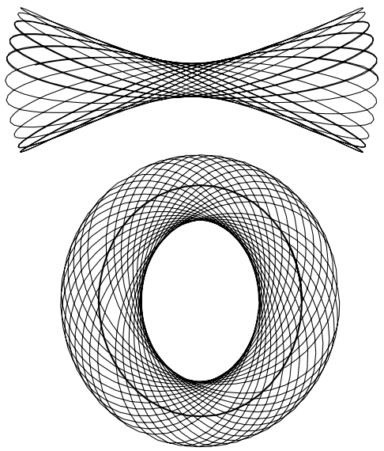

# Week6: Orbits

## Non-axisymmetric potentials

### Logarithmic potential

$$
\Phi_L(x,y)=\frac12v_0^2\ln\left(R_c^2+x^2+\frac{y^2}{q^2}\right),\quad 0<q<1
$$

Here, the angular momentum no longer conserves, though we still have a conserved Hamiltonian

- $$
  x^2+\frac{y^2}{q^2}\ll R_C^2\Rightarrow \Phi_L(x,y)=v_0^2\ln R_c+\frac{v_0^2}{2R_c^2}\left(x^2+\frac{y^2}{q^2}\right)
  $$

  This is just the potential of an harmonic oscillator, and when $q$ is irrational, the orbit does not close

- $$
  x^2+\frac{y^2}{q^2}\gg R_C^2\Rightarrow \Phi_L(x,y)=\frac12v_0^2\ln\left(x^2+\frac{y^2}{q^2}\right)
  $$

  - if $q=1$, $\Phi_L=v_0^2\ln R$, and the circular speed is a constant - consistent with the flat circular-speed curves of many disk galaxies

In general, there are two kinds of closed orbits, namely **box orbits** (above) and **loop orbits** (below)

- **Box orbits**
  - $R\ll R_c$ (oscillator) + could be distorted when $R\gtrsim R_c$, 
  - Zero time-averaged angular momentum
  - Two integrals (two independent oscillations parallel to the coordinate axes)
- **Loop orbits**
  - $R\gg R_c$
  - **Closed loop orbit**
    - closes on itself after one revolution
    - zero annular width

### Rotating logarithmic potential

Let the frame of reference in which the potential $\Phi$ is static rotate steadily at angular velocity $\vec\Omega_b$ - **pattern speed**

- Lagragian
  $$
  \mathcal{L}=\frac12\left|\dot{\vec x}+\vec\Omega_b\times\vec x\right|^2-\Phi(\vec x)
  $$

- Momentum
  $$
  \vec p=\frac{\partial \mathcal L}{\partial \dot{\vec x}}=\dot{\vec x}+\vec\Omega_b\times\vec x
  $$

- Hamiltonian
  $$
  \begin{align*}
  H_J&=\vec p\cdot\dot{\vec x}-\mathcal{L}\\
  &=\vec p\cdot\left(\vec p-\vec\Omega_b\times \vec x\right)-\frac12p^2+\Phi(\vec x)\\
  &=\frac12p^2+\Phi(\vec x)-\vec\Omega_b\cdot(\vec x\times\vec p)\\
  &=H-\vec\Omega_b\times\vec L
  \end{align*}
  $$
  $H_J$ has no explicit time dependence and is thus an integral, called the **Jacobi integral**
  $$
  E_J=\frac12\left|\dot{\vec x}\right|^2+\Phi_{eff}(\vec x)
  $$
  where
  $$
  \Phi_{eff}(\vec x)\equiv \Phi(\vec x)-\frac12\left|\vec\Omega_b\times\vec x\right|^2=\Phi(\vec x)-\frac12\left[\Omega_b^2x^2-\left(\vec\Omega_b\cdot \vec x\right)^2\right]
  $$
  is the sum of gravitational potential and a **centrifugal potential**.

- Hamilton's equations
  $$
  \left\{\begin{array}{l}
  \dot{\vec p}=-\nabla\Phi(\vec x)-\vec\Omega_b\times\vec p\\
  \dot{\vec x}=\vec p-\vec\Omega_b\times \vec x
  \end{array}\right.
  \Rightarrow \ddot{\vec x}=-\nabla\Phi(\vec x)-2\vec\Omega_b\times\dot{\vec x}-\vec\Omega_b\times\left(\vec\Omega_b\times\vec x\right)
  $$
  thus
  $$
  \ddot{\vec x}=-\nabla\Phi(\vec x)-2\vec\Omega_b\times\dot{\vec x}+\Omega_b^2\vec x-\left(\vec\Omega_b\cdot\vec x\right)\vec\Omega_b
  $$

  - **Coriolis force**
    $$
    -2\vec\Omega_b\times\dot{\vec x}
    $$

  - **Centrifugal force**
    $$
    -\vec\Omega_b\times\left(\vec\Omega_b\times\vec x\right)
    $$

  In the meantime
  $$
  \ddot{\vec x}=-\nabla\Phi_{eff}(\vec x)-2\vec\Omega_b\times\dot{\vec x}
  $$

- Lagrange points
  $$
  \nabla\Phi_{eff}=0
  $$
  When we expand $\nabla \Phi_{eff}$ around one of these points $\vec x_L=(x_L,y_L)$ in powers of $(x-x_L)$ and $(y-y_L)$, we have
  $$
  \Phi_{eff}(x_L,y_L)=\Phi_{eff}(x_L,y_L)+\frac12\frac{\partial^2\Phi_{eff}}{\partial x^2}\Bigg|_{\vec x_L}(x-x_L)^2\\
  +\frac{\partial^2\Phi_{eff}}{\partial x\partial y}\Bigg|_{\vec x_L}(x-x_L)(y-y_L)+\frac12\frac{\partial^2\Phi_{eff}}{\partial y^2}\Bigg|_{\vec x_L}(y-y_L)^2+\cdots
  $$
  For any bar-like potential whose principal axes lie along the coordinate axes, by symmetry, $\partial^2\Phi_{eff}/\partial x\partial y$ at $x_L$. Hence, if we retain only quadratic terms and define
  $$
  \xi\equiv x-x_L,\quad \eta\equiv y-y_L
  $$
  and
  $$
  \Phi_{xx}=\frac{\partial^2\Phi_{eff}}{\partial x^2}\Bigg|_{\vec x_L},\quad \Phi_{yy}=\frac{\partial^2\Phi_{eff}}{\partial y^2}\Bigg|_{\vec x_L}
  $$
  the equations of motion become
  $$
  \ddot \xi=2\Omega_b\dot\eta-\Phi_{xx}\xi,\quad \ddot \eta=-2\Omega_b\dot\xi-\Phi_{yy}\eta
  $$
  This is a pair of linear differential equations with constant coefficients!

  Let
  $$
  \xi=Xe^{\lambda t},\quad \eta=Ye^{\lambda t}
  $$
  we have
  $$
  \left\{\begin{array}{l}
  \left(\lambda^2+\Phi_{xx}\right)X-2\lambda\Omega_b Y=0\\
  2\lambda\Omega_b X+\left(\lambda^2+\Phi_{yy}\right)Y=0
  \end{array}
  \right.
  $$
  The simultaneous equations have a non-trivial solution only if the determinant
  $$
  \left|\begin{array}{cc}
  \lambda^2+\Phi_{xx}&-2\lambda\Omega_b\\
  2\lambda\Omega_b&\lambda^2+\Phi_{yy}
  \end{array}\right|=0
  $$

  $$
  \Leftrightarrow \lambda^4+\lambda^2\left(\Phi_{xx}\Phi_{yy}+4\Omega_b^2\right)+\Phi_{xx}\Phi_{yy}=0
  $$

  This is the **characteristic equation** for $\lambda$. If any of the four roots has non-zero real part, $\xi$ and $\eta$ will grow exponetially in time.